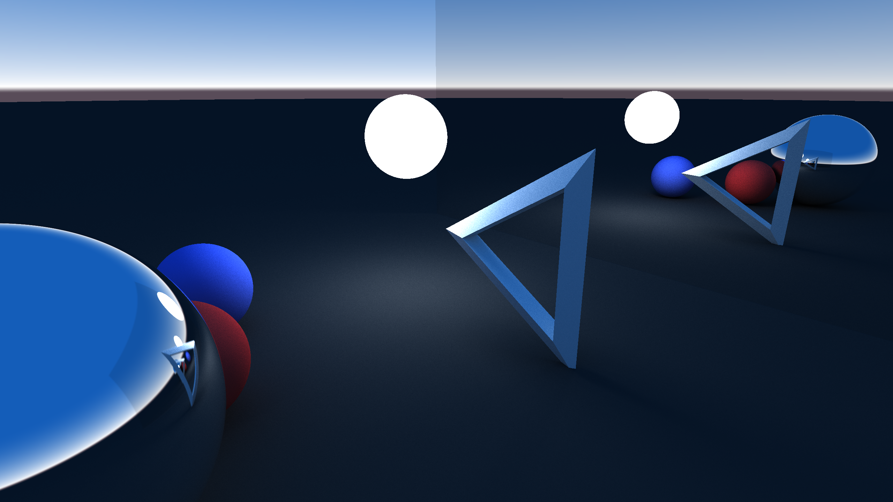

# OpenGL Ray Tracer


A ray tracer written in C++, with the path tracing calculations performed in OpenGL shaders.

## Build instructions:
You will need to adjust the paths to match your install directory. I'm sure there is a more standard way of doing this but I'm just working locally for testing and I'd rather spend my time learning OpenGL for now. \
From root project directory (highest level):
```
cmake -B build -S ./src/ -DCMAKE_TOOLCHAIN_FILE=/home/roboevt/dev/c++/OpenGLRayTracer/OpenGLRayTracer/vcpkg/scripts/buildsystems/vcpkg.cmake
cmake --build ./build/ --parallel 12
```